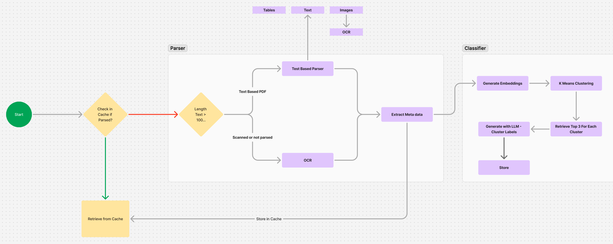
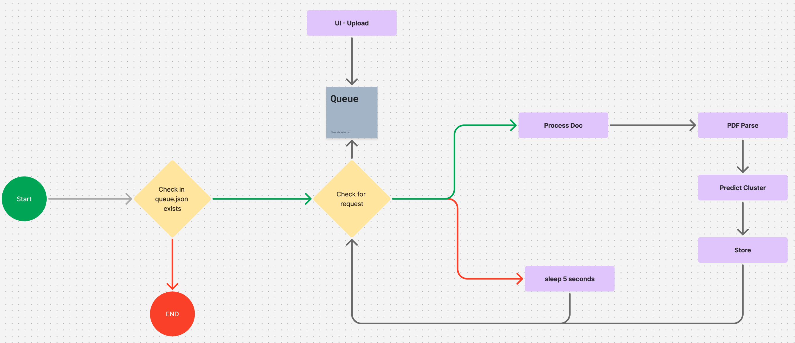
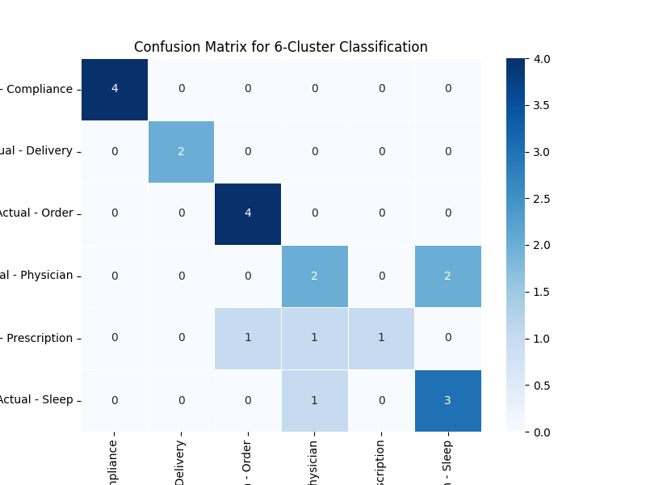
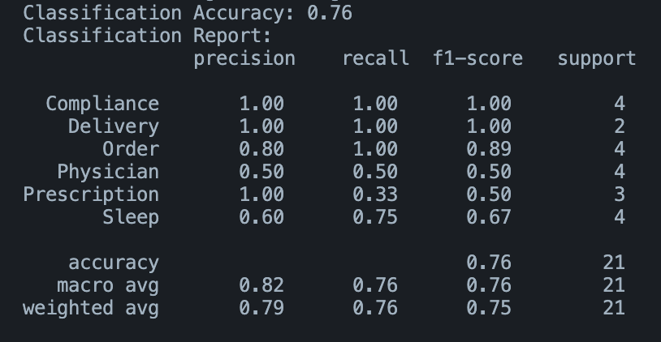

# Project Name

## Table of Contents

1. [Overview](#overview)
2. [Architecture](#architecture)
3. [Setup and Installation](#setup-and-installation)
4. [Usage](#usage)

---

## Overview

The system was designed to read PDF files, classify them into six categories, and store relevant classification information for further analysis. Since working in a startup often involves handling ambiguity, the system is designed with flexibility in mind. It consists of three main components:

1. **Streamlit UI** - A simple web interface to upload and visualize classified documents.
2. **Python Queue System** - A queue that processes newly uploaded documents asynchronously to avoid blocking the user interface.
3. **Document Processing and Classification**
   - **PDF Parsing** - Extracts text from the uploaded PDFs for further analysis.
   - **K-Means Clustering** - Groups the documents into six clusters based on text similarity.
   - **Internal LLM-Based Classification** - Uses a large language model (LLM) hosted locally to classify documents by analyzing the top three documents in each cluster.
4. **Storage** - Classification results are stored in a NoSQL database (MongoDB) locally for easy retrieval and further analysis.

## Assumptions

- Due to privacy concerns, external APIs such as LLamaParse for smart PDF parsing or OpenAI models.
- The number of clusters will remain fixed at six.
- We do not have pre-labeled clusters, meaning the system must infer document categories.
- Due to the small dataset (21 documents), classical machine learning techniques may not perform well, so clustering combined with LLM classification is used.

## Architecture

#### Overall



#### Queue



## Evaluation




## Setup and Installation

Follow these steps to set up the project locally:

1. **Install Tesseract OCR**  
   For macOS, use Homebrew to install Tesseract:

   ```bash
   brew install tesseract
   ```

2. **Set Up a Virtual Environment**
   ```bash
    python3 -m venv venv
    source venv/bin/activate
    pip install -r requirements.txt
   ```
3. **Confirm Tessaract**

   ```bash
   tesseract --version
   ```

4. **Instal MongoDB**

   ```bash
   brew tap mongodb/brew
   brew update
   brew install mongodb-community@8.0
   ```

5. **Run MongoDB**

   ```bash
   brew services start mongodb/brew/mongodb-community
   ```

6. **Set Up MongoDB**

   ```bash
   mongosh
   use admin
   db.createUser({
   user: "",
   pwd: "",
   roles: [ { role: "root", db: "admin" } ]
   })
   ```

7. **Create a Database**

```bash
  mongosh
  use db_name
```

7. **Ollama**

```bash
  brew install ollama
  brew services start ollama
  ollama run deepseek-r1:1.5b
```

## Usage

### Running the Frontend

1. **Run Streamlit App**

   ```bash
   streamlit run frontend/ui.py
   ```

1. **Run IDP Queue**
   ```bash
   python3 process_queue.py
   ```
