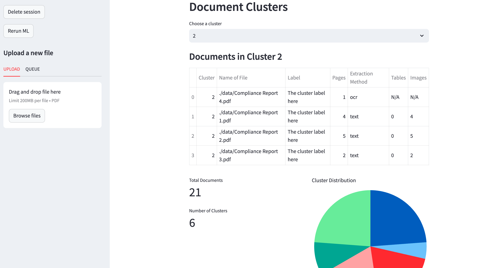

# Project Name

## Table of Contents

1. [Overview](#overview)
2. [Architecture](#architecture)
3. [Setup and Installation](#setup-and-installation)
4. [Usage](#usage)

---

## Overview

The system was designed to read PDF files, classify them into six categories, and store relevant classification information for further analysis. Since working in a startup often involves handling ambiguity, the system is designed with flexibility in mind. It consists of three main components:

1. **Streamlit UI** - A simple web interface to upload and visualize classified documents.
2. **Python Queue System** - A queue that processes newly uploaded documents asynchronously to avoid blocking the user interface.
3. **Document Processing and Classification**
   - **PDF Parsing** - Extracts text from the uploaded PDFs for further analysis.
   - **K-Means Clustering** - Groups the documents into six clusters based on text similarity.
   - **Internal LLM-Based Classification** - Uses a large language model (LLM) hosted locally to classify documents by analyzing the top three documents in each cluster.
4. **Storage** - Classification results are stored in a NoSQL database (MongoDB) locally for easy retrieval and further analysis.



## Assumptions

- Due to privacy concerns, external APIs such as LLamaParse for smart PDF parsing or OpenAI models.
- The number of clusters will remain fixed at six.
- We do not have pre-labeled clusters, meaning the system must infer document categories.
- Due to the small dataset (21 documents), classical machine learning techniques may not perform well, so clustering combined with LLM classification is used.

## Architecture

#### Overall


#### Queue


## Evaluation


### Performance

The overall classification accuracy is 76%, meaning that 76% of the documents were correctly classified.

- Compliance and Delivery have perfect precision, recall, and F1-scores (1.00).
- Order has a high recall (1.00) and a decent precision (0.80), leading to an F1-score of 0.89.
- Physician has both precision and recall at 0.50, meaning it only gets half of its classifications correct.

- Prescription has low recall --> Many true "Prescription" documents were misclassified

The confusion between Physician and Prescription suggests that these clusters might have overlapping content.

The high recall for Order means that most instances are correctly retrieved, but the slightly lower precision suggests some misclassification into this category.

### Limitations

- If we want to add new catagories we will have to edit the code and then the model performance might degrade with more clusters.

- LLM prediction using small LLM needs a lot of prompt engineering and trial error to reach a good state. Some preprocessing on do should be done.

- PDF Parsing might be computational expensive. Maybe Using more advanced Parsing method could lead to better results.

### Future Work

#### UI

- A lot of work on the UI is needed, ability to control the pdf states, preview them.
- Manually override cluster labels
- Chat functionality with pdfs
- Search Efficiently the documents

#### Queue System

- Migrate to Redis with actual worker running in the background
- Use Cloud solutions like lambda functions to deal with file processing

#### Parsing

- Migrate to Cloud Solutions: More advanced parsing
- Or add structure to the parsing, keeping track of the structure of the documents

#### Classification

- Rather than embeddins the entire documents, we could embbedd Multiple Chunks Classification and take majority vote
- Migrate to LLM solution where we classify using prompt engineering
- Try out multiple models and compare performance

Other Solutions:

- LLM based classification
- ML Techniques like Random Forest
- Basic Classification Feed Forward Neural Network
- Train a BERT classifier

#### Storage

- Create a Vector Store and store the embeddings for context retrieval

#### RAG system

- Chat with your pdfs using simple vector store and embeddings already created.

## Setup and Installation

Follow these steps to set up the project locally:

1. **Install Tesseract OCR**  
   For macOS, use Homebrew to install Tesseract:

   ```bash
   brew install tesseract
   ```

2. **Set Up a Virtual Environment**
   ```bash
    python3 -m venv venv
    source venv/bin/activate
    pip install -r requirements.txt
   ```
3. **Confirm Tessaract**

   ```bash
   tesseract --version
   ```

4. **Instal MongoDB**

   ```bash
   brew tap mongodb/brew
   brew update
   brew install mongodb-community@8.0
   ```

5. **Run MongoDB**

   ```bash
   brew services start mongodb/brew/mongodb-community
   ```

6. **Set Up MongoDB**

   ```bash
   mongosh
   use admin
   db.createUser({
   user: "",
   pwd: "",
   roles: [ { role: "root", db: "admin" } ]
   })
   ```

7. **Create a Database**

```bash
  mongosh
  use db_name
```

7. **Ollama**

```bash
  brew install ollama
  brew services start ollama
  ollama run deepseek-r1:1.5b
```

## Usage

### Running the Frontend

1. **Run Streamlit App**

   ```bash
   streamlit run ui.py
   ```

1. **Run IDP Queue**
   ```bash
   python3 process_queue.py
   ```
